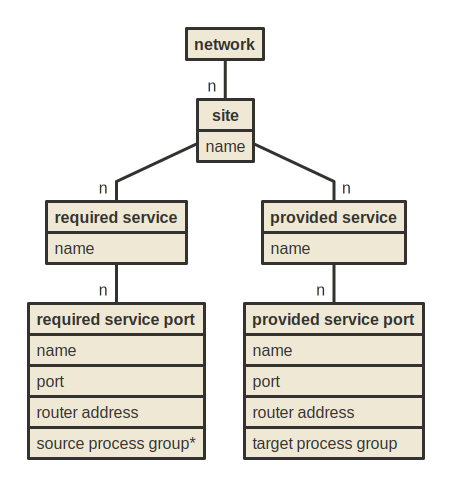
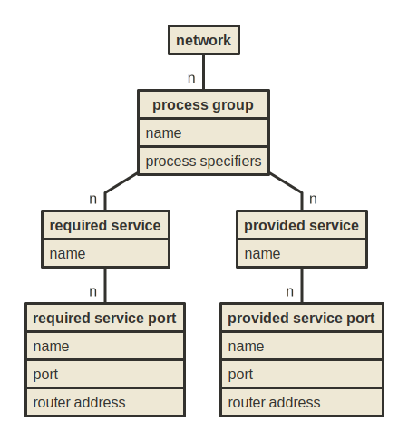

# Provided and required services

Two models ...

## Site oriented

west.conf (site-specific):
~~~
site "west" {
    provides service "frontend:8080" implemented by process group "deployment/frontend"
    requires service "database:5432" used by process group "deployment/frontend"
}
~~~

east.conf (site-specific):
~~~
site "east" {
    provides service "database:5432" implemented by process group "deployment/postgresql"
}
~~~

## Process group oriented

Key behavior: A process group is active on a given site
if any of its specifiers match site-local workloads.

wholeapp.conf (network-global):
~~~
process group "database" {
    provides service "database:5432"
    implemented by "deployment/postgresql"
}

process group "frontend" {
    requires service "database:5432"
    implemented by "deployment/frontend"
}
~~~

